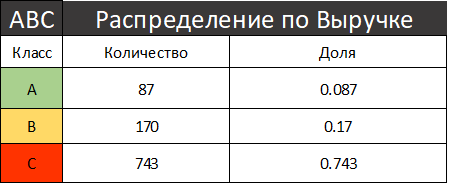
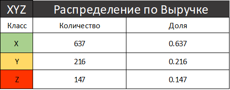
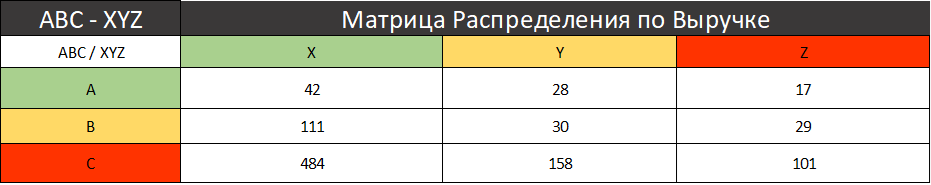

# ABC-XYZ-Inventory-Analysis
Data: https://www.kaggle.com/datasets/shahriarkabir/abc-xyz-inventory-classification-dataset
# ABC-XYZ Анализ ассортимента товаров

Данный проект посвящен проведению многомерного ABC-XYZ анализа ассортимента товаров на основе исторических данных о продажах и спросе. Цель — сегментировать товарные позиции для оптимизации управления запасами, выявления ключевых драйверов выручки и минимизации рисков.

## 1. Бизнес-проблема
В розничной торговле и управлении цепочками поставок критически важно понимать, какие товары приносят основную прибыль, а какие занимают складские площади без должной отдачи. 

**Основные вопросы, которые решает данный анализ:**
*   Какие товары генерируют 80% выручки? (ABC-анализ по выручке).
*   Какие товары пользуются стабильным спросом, а какие подвержены сезонным или хаотичным колебаниям? (XYZ-анализ по коэффициенту вариации).
*   Как оптимизировать закупки и складские запасы, чтобы не замораживать капитал в неликвидных или нестабильных товарах?

## 2. Описание датасета
Для анализа используется файл `abc_xyz_dataset.csv`, содержащий 1000 записей (уникальных товаров).

**Структура данных:**
*   `Item_ID`: Уникальный идентификатор товара.
*   `Item_Name`: Название товара.
*   `Category`: Категория товара (Grocery, Apparel, Electronics, Toys, Home & Kitchen).
*   `Jan_Demand` ... `Dec_Demand`: Ежемесячный спрос (количество проданных единиц) за год.
*   `Total_Annual_Units`: Суммарное количество проданных единиц за год.
*   `Price_Per_Unit`: Цена за единицу товара.
*   `Total_Sales_Value`: Общая выручка от продаж товара за год.

## 3. Результаты анализа
Анализ проводился с помощью SQL-скриптов (`abc.sql`, `xyz.sql`, `abc_xyz.sql`), которые рассчитывают кумулятивные доли выручки, коэффициент вариации спроса и объединяют полученные классы.

### 3.1. ABC-анализ (Распределение по выручке)
Классификация проведена по правилу Парето: класс A — до 80% накопленной выручки, класс B — от 80% до 95%, класс C — оставшиеся 5%.

 

### 3.2. XYZ-анализ (Распределение по стабильности спроса)
Классификация основана на коэффициенте вариации (CV) ежемесячного спроса:
*   X: CV <= 0.1 (стабильный спрос)
*   Y: 0.1 < CV <= 0.2 (колеблющийся спрос)
*   Z: CV > 0.2 (нерегулярный/случайный спрос)

### 3.3. Матрица ABC-XYZ
Совмещение результатов двух анализов позволяет выделить 9 групп товаров с различными стратегиями управления.

**Ключевые выводы по матрице:**
*   **AX (42 товара):** Ядро бизнеса. Высокая выручка, стабильный спрос. Требуют постоянного наличия на складе.
*   **CZ (101 товар):** Наибольшая группа риска. Низкая выручка, хаотичный спрос. Кандидаты на вывод из ассортимента или закупку под конкретный заказ.
*   **AZ (17 товаров):** Высокая выручка, но непредсказуемый спрос. Требуют тщательного прогнозирования и страховых запасов.
